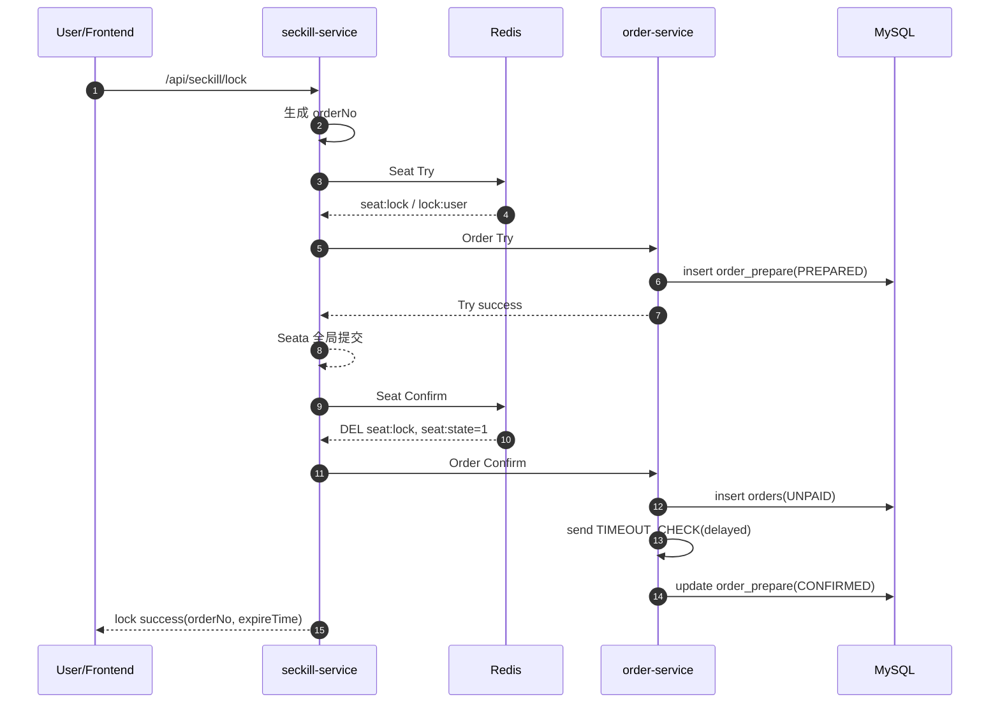
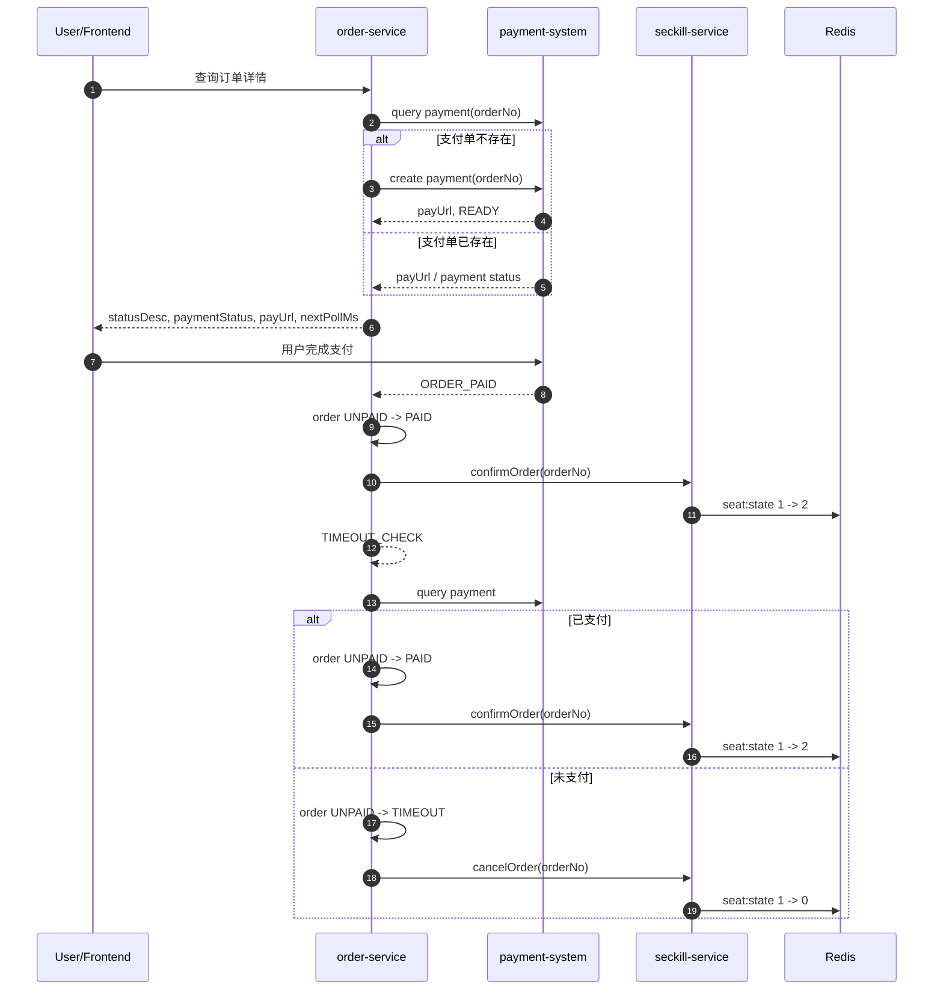

# Seckill TCC Sequence

当前仓库的锁座 + 下单链路已经接入 Seata TCC，不再保留旧的 `lockId`、`TryCreateOrder` 直建正式单，也不保留 Redis 过程态聚合。

## Seata 版本要求

- 当前锁座 + 下单链路依赖 Seata TCC。
- 当前仓库已验证的运行组合是 `Seata client 2.0.0 + Seata server 2.6.0`。
- 仓库依赖已接入 Seata 客户端，实际联调时必须保证 Server / Client 版本组合可正常完成 TCC `BranchRegister`。
- 不要仅因为本机 Seata Server 升级，就直接同步修改 `pom.xml` 里的 client 版本；必须先确认 Maven 坐标可解析，再做依赖升级回归。
- 本地若切换 Seata 版本，应以当前运行中的 Server 文档和联调结果为准，避免继续沿用已知不兼容组合。

## 角色

- `seckill-service`：生成 `orderNo`，发起 Seata 全局事务，执行座位 Try/Confirm/Cancel。
- `order-service`：执行订单 Try/Confirm/Cancel；Confirm 时创建正式单并发送超时消息。
- `payment-system`：只负责模拟支付，不纳入 Seata 分布式事务。
- `Redis`：只保留 `seat:state:*`、`seat:lock:*`、`lock:user:*`。
- `MySQL`：保留 `order_prepare` 预留表和 `orders` 正式订单表。

## Redis / MySQL 事实

- `seat:state:{sessionId}:{seatId}`：长期状态，`0=可售`，`1=已下单未支付`，`2=已售出`。
- `seat:lock:{sessionId}:{seatId}`：TCC Try 临时锁，值为 `TRY|userId|orderNo|xid`，空回滚标记为 `CANCEL|userId|orderNo|xid`。
- `lock:user:{sessionId}:{userId}`：用户维度锁索引，值为 `TRY|orderNo|xid` 或 `CANCEL|orderNo|xid`。
- `order_prepare`：订单 TCC Try 资源表，状态含 `PREPARED / CONFIRMED / CANCELED`。
- `orders`：正式订单表，只在 TCC Confirm 创建 `UNPAID` 订单。

## 锁座 + 下单 TCC

## 支付与收敛

## TCC 语义

- Seat Try：只写临时锁，不改长期状态。
- Seat Confirm：删除临时锁，把 `seat:state` 写成 `1`。
- Seat Cancel：删除临时锁；若 Try 尚未到达，则写 `CANCEL` marker 防空回滚。
- Order Try：只写 `order_prepare(PREPARED)`。
- Order Confirm：创建 `orders(UNPAID)`，发送 `TIMEOUT_CHECK`，再把 `order_prepare` 标记为 `CONFIRMED`。
- Payment Prepare：不在锁座 TCC 内执行；`order-service` 在订单详情查询时先 `query payment`，若支付单不存在则按需 `create payment`，再向前端返回 `payUrl` 与 `paymentStatus=READY`。
- Order Cancel：把 `order_prepare` 标记为 `CANCELED`；若 Try 尚未到达，则插入空回滚标记。

## 关键约束

- `orderNo` 是唯一业务主键，同时也是 Redis 锁 owner token。
- 支付不纳入 Seata；支付成功后的 `1 -> 2` 与超时取消后的 `1 -> 0` 仍由异步回调收敛。
- 支付单采用懒创建模型，前端必须先轮询订单详情，再进入 `READY -> 支付 -> ORDER_PAID` 链路。
- Confirm 之后不再保留临时锁，长期状态只靠 `seat:state` 的 `0/1/2` 表达。

## 并发裁决补充

- `OrderPaidConsumer` 只允许订单执行 `UNPAID -> PAID`。
- 若 `ORDER_PAID` 到达时订单已是 `CANCELLED / TIMEOUT / REFUNDED`，消费者只记录告警并跳过，不再覆盖既有终态。
- `OrderTimeoutCheckConsumer` 只处理仍为 `UNPAID` 的订单：
  - 支付已成功则执行 `UNPAID -> PAID`，并通知 `seckill-service` 把 `seat:state` 从 `1` 更新为 `2`
  - 仍未支付则执行 `UNPAID -> TIMEOUT`，并通知 `seckill-service` 把 `seat:state` 从 `1` 释放为 `0`
- 用户主动取消只允许执行 `UNPAID -> CANCELLED`；若状态已变化，则取消直接失败。
- 因此订单终态收敛已经固定为条件更新模型，多个异步链路不会互相覆盖。

## 测试钩子说明

- `order-service` 提供了 `POST /internal/orders/test/timeout-delay`，用于故障演练时人为延迟下一次 `TIMEOUT_CHECK` 消费。
- 该能力默认关闭，只有在显式设置 `tpp.test.runtime-hooks-enabled=true` 后才可使用。
- 该钩子只用于并发回放验证，不属于正常业务链路。
